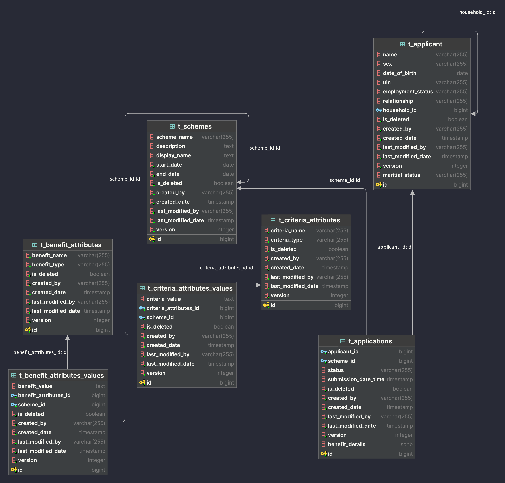

# Financial Assistance Scheme Management System

## Table of Contents

- [Overview](#overview)
- [Features](#features)
- [Technologies Used](#technologies-used)
- [Getting Started](#getting-started)
- [Contributors](#contributors)

## Overview

The Financial Assistance Management System is a backend application designed to manage financial assistance schemes for
individuals and families in need. It includes features such as administrator account management, applicant record
handling (including creation, updating, and outcome tracking), and scheme eligibility recommendations.

## Features

- User Registration: Users can register for a new account.
- User Authentication: Existing users can log in to their accounts securely.
- Scheme Management: Users can view all available schemes and receive advice on scheme eligibility.
- Applicant Management: Users can create / retrieve applicant(s).
- Application Management: Users can create / view application(s).

### Database Design



## Technologies Used

- Spring Boot 3
- Spring Security 6
- JWT Token Authentication
- Spring Data JPA
- OpenAPI and Swagger UI Documentation
- Docker
- Postgres
- Flyway

## Prerequisite

Before cloning this project, make sure you have the following tools installed:

1. Maven
2. Docker

## Getting Started

To set up the project, follow these steps:

1. Clone the repository:

```bash
   git clone https://github.com/jinhao97/financial-assistance-scheme-management-system.git
```

2. Package JAR file

```bash
   mvn clean package -DskipTests
```

3. Run docker-compose file

```bash
   docker-compose up -d
```

4. Access the API documentation using Swagger UI:

Open a web browser and go to http://localhost:8080/swagger-ui/index.html.

5. Make a POST request to /api/v1/auth/login with the default admin user to get a valid JWT token

```bash
  curl -X POST http://localhost:8080/api/v1/auth/login -H "Content-Type: application/json" -d "{\"email\":\"admin@gmail.com\", \"password\":\"admin\"}"
```

6. Add the JWT token in the authentication window that appears when the Authorize button is clicked.
   

7. Make initial GET request to /api/schemes and it should return a valid response
   

## Contributors

- [Jin Hao](https://github.com/jinhao97)